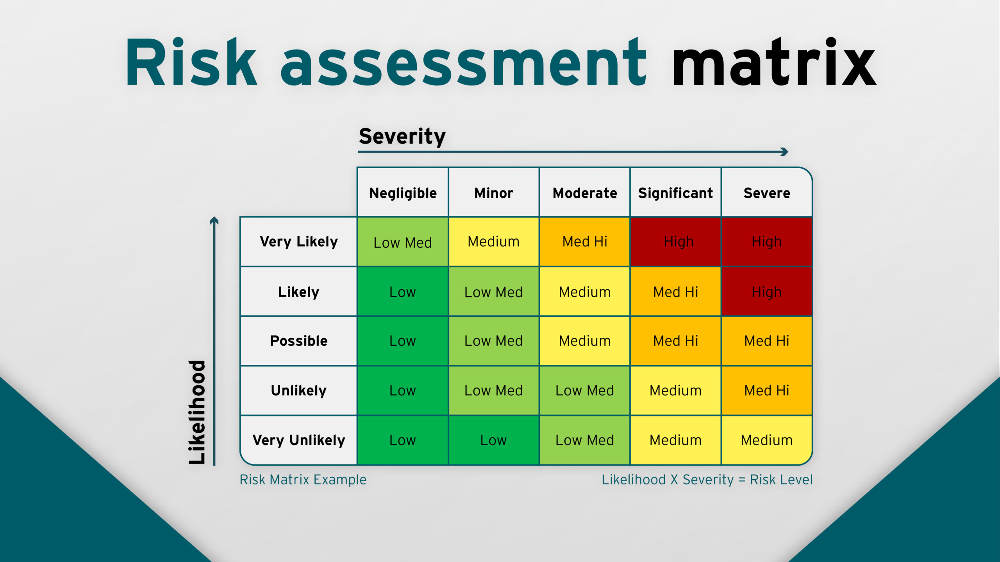

# Security Fundamentals; Risk

### Risk?!?!

tl;dr
is a possibility of a negative impact on practically ANYTHING, while vulnerability is a weakness that can be exploited by a thread.

Vulnerabilities can be managed whereas a threat cannot

#### Risk Assessments
... are conducted to identify & determine the impacts, likelihood, and consequences 

✅ can help organisations make informed decisions based on the outcome of the assessments

this reminds me of risk assessment matrix from uni course

**Conducting an assessment**
- identifying potential hazards
- identifying who might be harmed by those hazards
- evaluating list (severity & likelihood) & establishing suitable precautions
- implementing controls & recording your findings
- assessment review & re-assessment if necessary

**Managing Risk**
- Mitigate
- Transfer
- Accept (e.g. some businesses just take the risk)
- Avoid

#### Policies & Procedures
Policy; a plan of intent or course of action towards a particular domain
(it can be laws/regulations or sometimes principles, direction, guidlines etc)

e.g. **Acceptable Use Policy (AUP)**
This is a document that stipulates what a user can and cannot do on a corporate, university, or internet service provider (ISP) network and /or internet access.
or **Bring Your Own Device (BYOD)**

**SOP** - Standard Operating Procedures
A standard operating procedure is a step-by-step set of instructions developed for a routine task.

#### Compliance & Frameworks
