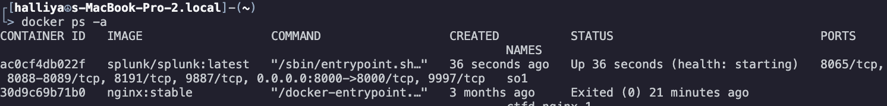
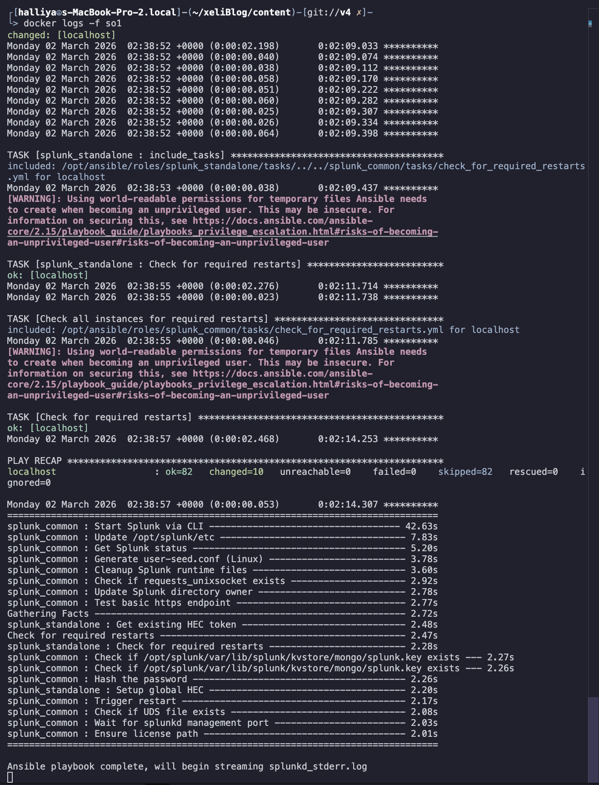
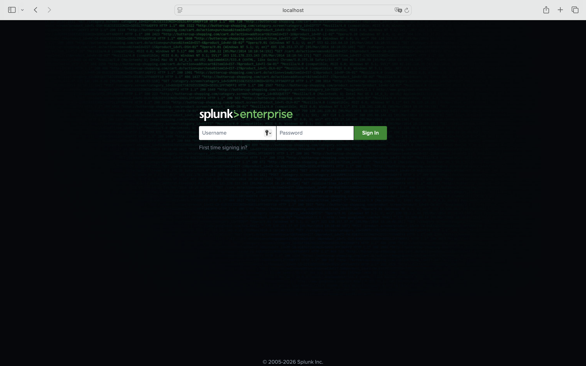

This post is to remind me how to set up splunk since I don't trust my memory sometimes lol.


## Get started

First things first, you will need to pull the docker image!

I used latest version, but you can also specify version that you want to use following these commands.

`docker pull splunk/splunk:latest` or just simply `docker pull splunk/splunk:<version>`


## Docker run command
Now you want to set up the docker container.

I used docker command from official [Splunk Github repo] (https://github.com/splunk/docker-splunk).

```
docker run -p 8000:8000 -e "SPLUNK_PASSWORD=<password>" \
             -e "SPLUNK_START_ARGS=--accept-license" \
             -e "SPLUNK_GENERAL_TERMS=--accept-sgt-current-at-splunk-com" \
             -it --name so1 splunk/splunk:latest
```

However, still bumping into some issues - I keep forget that I'm using M3 Mac 😭
I'll force to emulate with amd64 using ```--platform=linux/amd64 ```.


```
docker run --platform=linux/amd64 \
  --privileged -d -p 8000:8000 \
  -e SPLUNK_PASSWORD=<PASSWORDHEREEE> \
  -e SPLUNK_START_ARGS="--accept-license" \
  -e SPLUNK_GENERAL_TERMS="--accept-sgt-current-at-splunk-com" \
  --name so1 \
```

Then, you can check if the container is up using `docker ps -a`.



If unsure if it's crashing or not, use `docker logs -f so1` to check if everything is building without error :)!



See how everything setted up without failed task?
Now it's time to leave this behind, and go check localhost:8000.

## localhost


and VOILA! Here we are, the main page of Splunk.